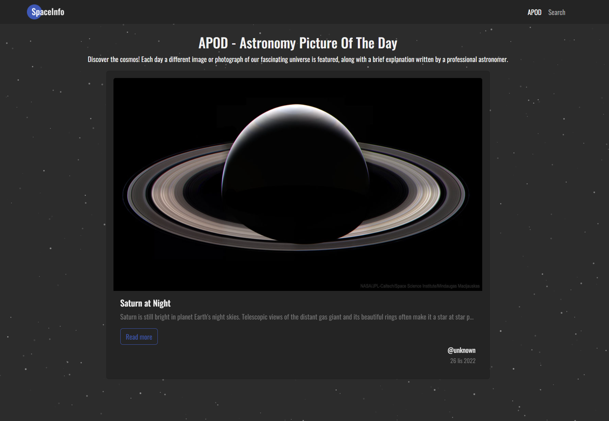

# 

Spaceinfo is an application built with **Vue** for university project.
It is the first approach to Vue based application using the free version of NASA API.

If you are interested in using the API please follow [this link](https://api.nasa.gov/).

It uses two public endpoints: `APOD` and `NASA Image and Video Library`

 
If you would like to test it here is [link to demo](https://lukasz-ciskowski.github.io/spaceinfo)


## Project

My approach was to use the latest API and structure proposed by Vite Team.
This project was made using `Vue3` + `Vite` using `Typescript` and Composition API. 
Additionally it has been built with `Bootstrap 5` and `scss`.

## Instalation

In order to run Spaceinfo locally you need to follow these steps:

### Setup

```bash
# installing dependencies
yarn / npm install

# setup dev version
npm run dev
```
